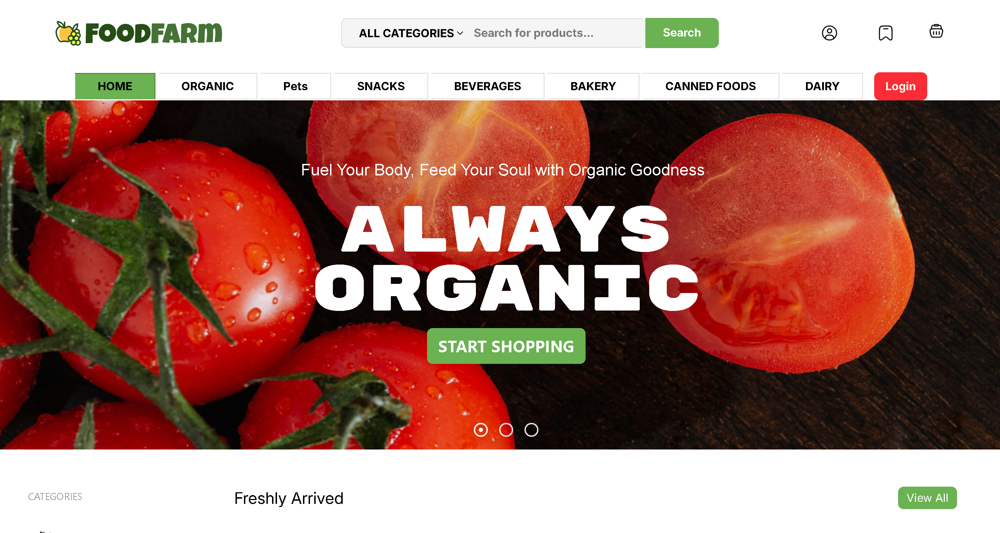
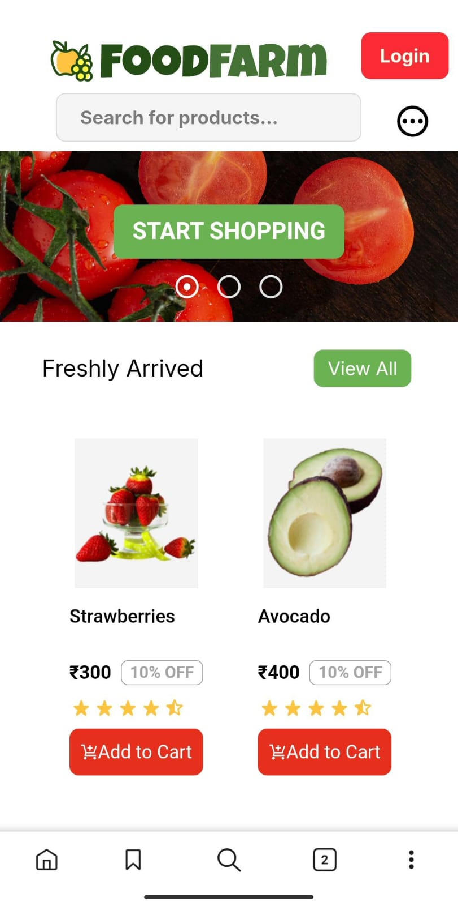

# 🛒 FoodFarm - E-Commerce Grocery Website

Welcome to **FoodFarm**, a modern and responsive e-commerce grocery platform built with 💚. This platform allows users to browse, search, filter, and purchase grocery items in a smooth and interactive way.

 <!-- optional preview image if you have -->

---

## 🚀 Features

### 🌐 General
- **Fully Responsive Design** (Mobile, Tablet & Desktop)
- Built using **Node.js, Express, MongoDB, and EJS**
- Tailwind CSS for modern UI and flexible styling

---

### 🔍 Product Browsing
- ✅ **Search Bar**: Search items by name instantly
- ✅ **Category Filtering**: Browse items by clicking categories like `Snacks`, `Organic`, `Dairy`, etc.
- ✅ **Dynamic Pages**: Each category or search result updates the view seamlessly
- ✅ **Freshly Arrived Section**: Displays newly added or promoted products

---

### 🛒 Cart & Checkout
- ✅ **Add to Cart**: Add products to your cart from any page
- ✅ **Cart Management**: View, update, and remove items from the cart
- ✅ **Total Price Summary**: Calculates price, discount, convenience fee, and total
- ✅ **Clear Cart**: Cart is automatically cleared after successful payment

---

### 🔐 Authentication
- ✅ **Login with Google** using **OAuth 2.0 and Passport.js**
- ✅ Protected dashboard routes using sessions
- ✅ Displays user's name, photo, and email after login

---

### 💳 Payment Integration
- ✅ **Razorpay** test integration for demo payments
- ✅ Dummy payment flow with success and failure handlers
- ✅ Saves payment success info and redirects to confirmation page

---

## 📸 Screenshots

### 🖥️ Desktop View  

### 📱 Mobile View  

---

## 🛠️ Tech Stack

| Category         | Technology        |
|------------------|-------------------|
| Frontend         | HTML, EJS, Tailwind CSS |
| Backend          | Node.js, Express.js |
| Authentication   | Passport.js + Google OAuth |
| Database         | MongoDB + Mongoose |
| Payments         | Razorpay (Test Mode) |
| Hosting          | GitHub + Render |

---

